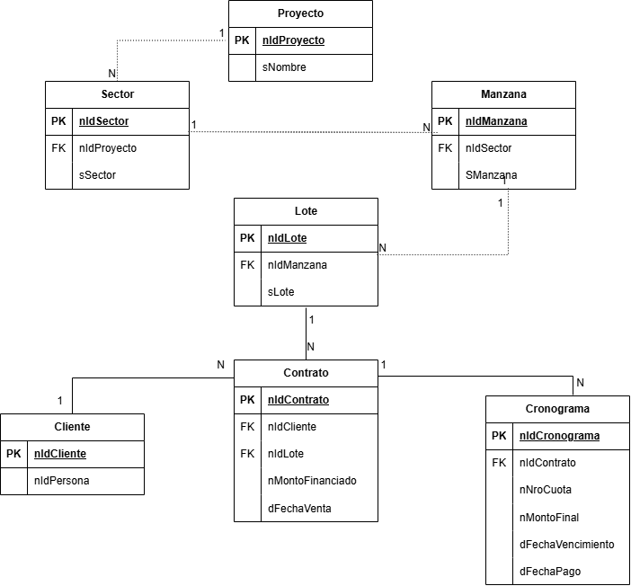
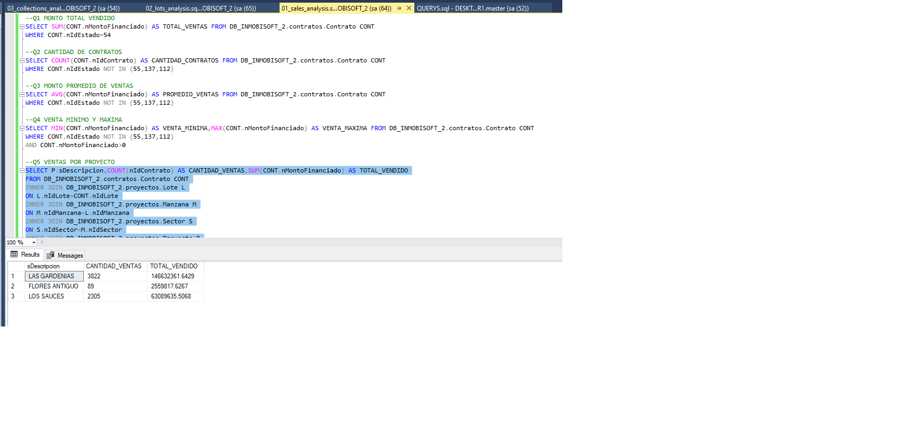
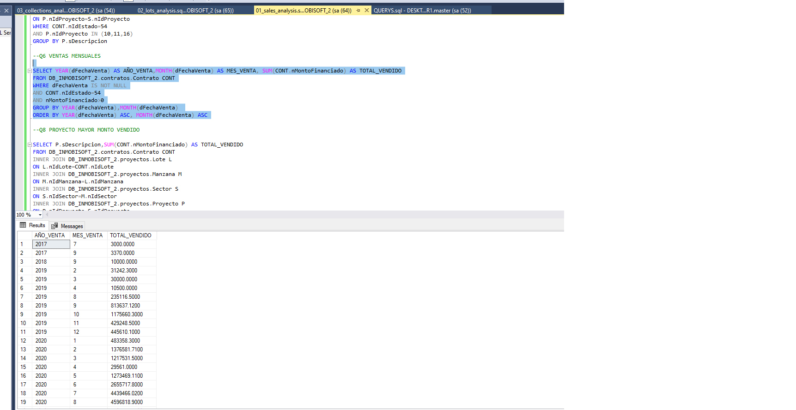
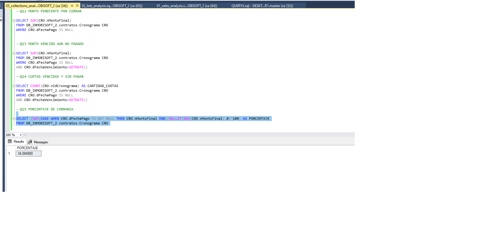

# Real Estate Sales & Collections Analytics

## Descripción

Proyecto de análisis de datos inmobiliarios desarrollado con SQL Server.

El objetivo es analizar las ventas de lotes y el estado de las cobranzas,
obteniendo indicadores que permitan conocer el comportamiento comercial
y financiero de los proyectos inmobiliarios.

## Objetivos

- Analizar el monto total de ventas.
- Analizar las ventas por proyecto.
- Analizar la evolución mensual de las ventas.
- Identificar los lotes vendidos.
- Analizar los montos vendidos por lote.
- Identificar montos pendientes de cobro.
- Identificar cuotas vencidas e impagas.
- Calcular el porcentaje de cobranza.

## Tecnologías

- SQL Server
- SQL
- Git
- GitHub

## Base de datos

El análisis utiliza información relacionada con:

- Proyectos
- Sectores
- Manzanas
- Lotes
- Contratos
- Clientes
- Cronogramas de pago

## Preguntas de negocio

El proyecto responde las siguientes preguntas:

### Ventas

1. ¿Cuál es el monto total vendido?
2. ¿Cuántos contratos de venta existen?
3. ¿Cuál es el promedio de venta?
4. ¿Cuál es el monto mínimo y máximo de venta?
5. ¿Cuál es el monto vendido por proyecto?
6. ¿Cuántas ventas tiene cada proyecto?
7. ¿Cómo evolucionan las ventas mensualmente?
8. ¿Qué proyecto presenta el mayor monto vendido?

### Lotes

9. ¿Cuántos lotes han sido vendidos?
10. ¿Cuántos lotes vendidos tiene cada proyecto?
11. ¿Cuál es el monto vendido por lote?

### Cobranzas

12. ¿Cuál es el monto total pendiente de cobrar?
13. ¿Cuál es el monto vencido que todavía no ha sido pagado?
14. ¿Cuántas cuotas están vencidas y sin pagar?
15. ¿Cuál es el porcentaje de cobranza?

## Principales KPIs

- Monto total vendido
- Número de contratos
- Promedio de venta
- Monto máximo y mínimo de venta
- Lotes vendidos
- Monto pendiente de cobro
- Monto vencido e impago
- Cuotas vencidas
- Porcentaje de cobranza

## Modelo de datos

El análisis se basa en las relaciones entre proyectos, lotes, contratos,
clientes y cronogramas de pago.

### Diagrama

### Relaciones principales

- Proyecto 1:N Sector
- Sector 1:N Manzana
- Manzana 1:N Lote
- Lote 1:N Contrato
- Cliente 1:N Contrato
- Contrato 1:N Cronograma

## Estructura del proyecto

Real Estate Sales & Collections Analytics
│
├── README.md
├── sql
│   ├── 01_sales_analysis.sql
│   ├── 02_lots_analysis.sql
│   └── 03_collections_analysis.sql
├── model
│   └── data_model.png
└── screenshots

## Resultados

El análisis permite obtener indicadores relacionados con:

- Volumen y monto total de ventas.
- Distribución de ventas por proyecto.
- Evolución mensual de las ventas.
- Cantidad de lotes vendidos.
- Monto vendido por lote.
- Monto pendiente de cobro.
- Monto vencido e impago.
- Cantidad de cuotas vencidas.
- Porcentaje de cobranza.

## Conclusiones

El proyecto permite utilizar SQL Server para transformar información
operativa de una empresa inmobiliaria en indicadores de ventas,
lotes y cobranzas.

El análisis proporciona una base para identificar tendencias de ventas,
comportamiento por proyecto, situación de las cobranzas y nivel de
cumplimiento de los pagos.

Los resultados obtenidos mediante SQL pueden utilizarse posteriormente
para construir un dashboard interactivo en Power BI.

## Evidencia de resultados

### Ventas por proyecto

### Evolución mensual de ventas

### Porcentaje de cobranza

